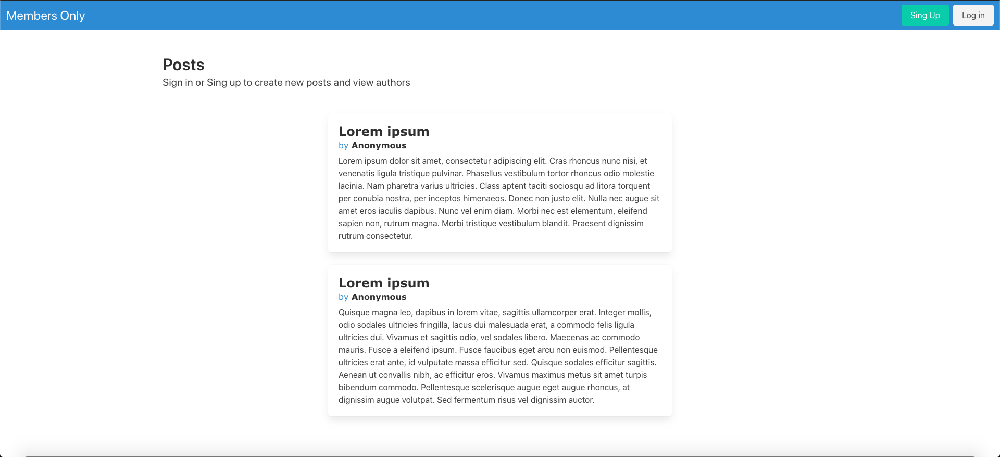

 # Members-only

## About 
This project creates a secret social media platform where only authorized members can see who posted a secret story.

## Screenshots 

## 🔧 Built with

- Ruby on Rails and Bulma

## 🔨 Setup    
- Clone this project from github using
- <code>$ git clone https://github.com/lirad/members-only-microverse.git</code>
- <code>cd members-only-microverse</code>
- <code>$ bundle install</code>
- <code>$ rails server</code>

## ✒️ Author 

👤 **Diego Lira**

- Github: [@lirad](https://github.com/lirad)
- Twitter: [@lirad](https://twitter.com/lirad)
- Linkedin: [Diego de Araujo Lira](https://www.linkedin.com/in/diegoalira/)

## 🤝 Contributing

Contributions, issues and feature requests are welcome!

Feel free to check the fork this repo and create pull request if you want to make changes.

## MIT Licence   :registered:

MIT License

Copyright (c) 2020

Permission is hereby granted, free of charge, to any person obtaining a copy
of this software and associated documentation files (the "Software"), to deal
in the Software without restriction, including without limitation the rights
to use, copy, modify, merge, publish, distribute, sublicense, and/or sell
copies of the Software, and to permit persons to whom the Software is
furnished to do so.

## 👍 Show your support

Give a ⭐️ if you like this project!

## :thumbsup: Acknowledgements
- Microverse  
- ThOdinProject 
